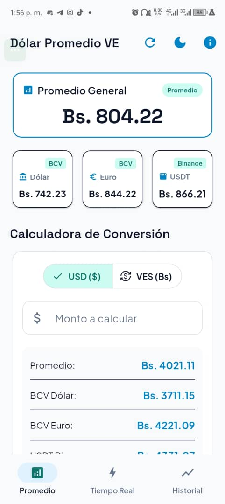
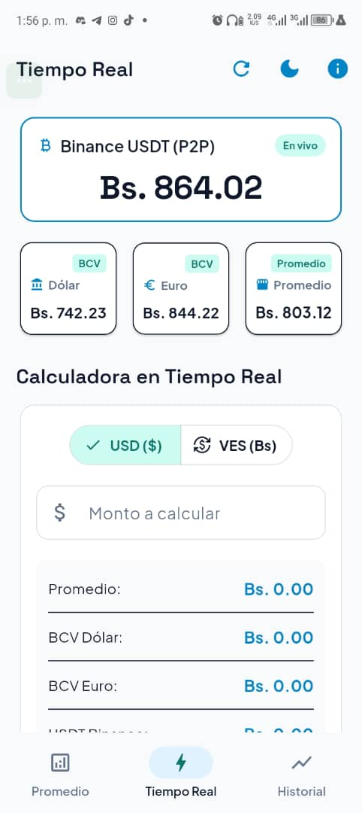
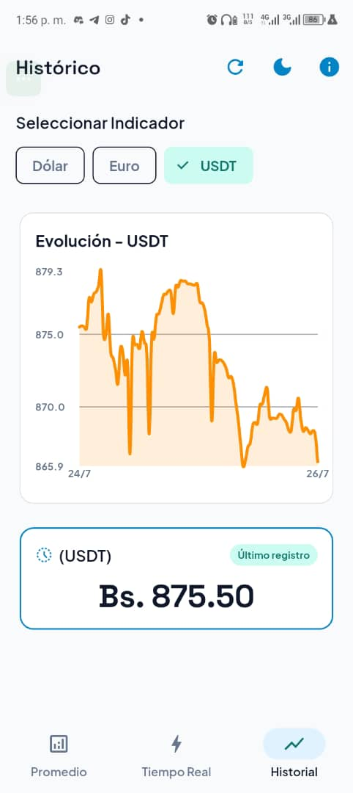
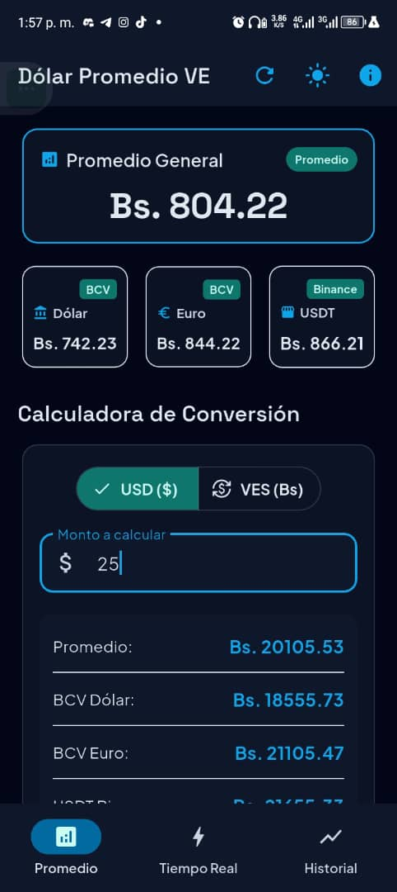
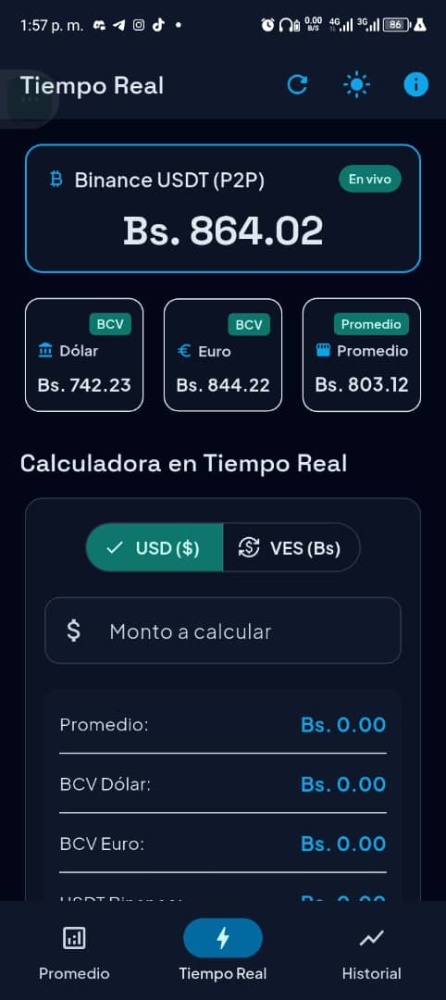
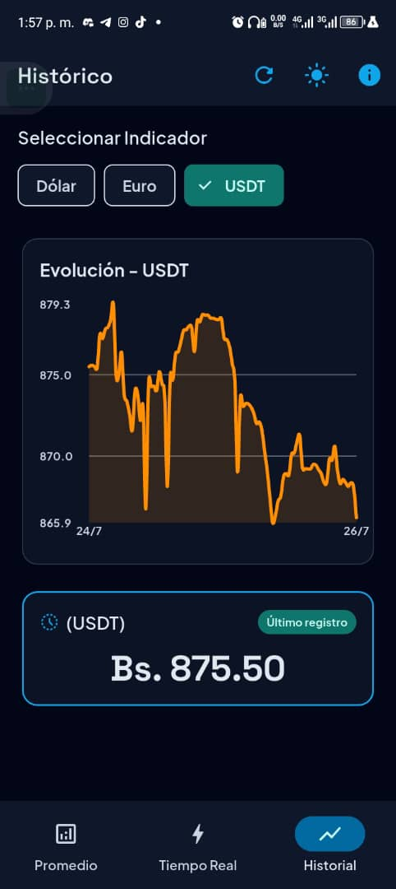

# Dolar Pulse VE: Mobile app para BnB-BCV

Bienvenidos a **Dolar Pulse VE**, la aplicación móvil para Android desarrollada en **Flutter** como cliente oficial de la app/API [BnB-BCV](https://github.com/gabrielbaute/binance-bcv-dolar). 

Esta herramienta permite consultar en tiempo real e históricamente las cotizaciones del mercado cambiario venezolano (BCV y Binance P2P), ofreciendo transparencia financiera, herramientas de conversión rápida y acceso abierto sin intermediarios ni manipulaciones. Si consultan el código del backend en [BnB-BCV](https://github.com/gabrielbaute/binance-bcv-dolar), podrán ver los métodos de cálculo de los promedios:

- USDT: promedio de los primeros 20 anuncios en USDT a la compra (por defecto, la aplicación guarda también los valores a la venta en la base de datos). La aplicación calcula también el promedio y la mediana de los precios.
- BCV: el servidor guarda los precios del BCV cada día a las 12 de la medianoche, si bien la enditad bancaria publica los precios de lunes a viernes a las 5pm, esos precios publicados siempre entran en vigencia a las 00:00 del siguiente día (y el precio publicado el viernes cubre sábado, domingo y lunes).

Por defecto, la aplicación se conecta a la API de nuestra instancia pública en producción:
👉 **[https://dolar-vzla.rafnixg.dev/](https://dolar-vzla.rafnixg.dev/)**

---

## 📸 Capturas de Pantalla (Screenshots)
#### Light-theme
<p align="center">
  
  
  
</p>
#### Dark-theme
<p align="center">
  
  
  
</p>

---

## 💡 Filosofía Open Source & Self-Hosted

Creemos firmemente en el software libre, la soberanía digital y el libre acceso a la información:

* **Transparencia y Datos Libres:** Tanto la aplicación como la API nacen de la necesidad de contar con datos fidedignos e inalterables en un mercado cambiario propenso a la especulación. Existen numerosas otras aplicaciones y servicios que ofrecen lo mismos datos, pero por lo general son de código cerrado. Nuestra aplicación y el backend que le acompañan son totalmente de código abierto y transparentes sobre los métodos de cálculo.
* **Licencia Abierta:** Distribuido bajo la licencia **GNU General Public License v3.0 (GPLv3)**.
* **Filosofía Self-Hosted:** Fiel a los principios de autoservicio e independencia, la aplicación permite cambiar la URL base de conexión en tiempo de compilación (como variables de entorno). Puedes desplegar tu propia instancia backend de **BnB-BCV** en tu servidor privado e interconectarla sin restricción alguna.

---

## 📱 Vistas de la Aplicación

La interfaz cuenta con un diseño basado en **Material 3**, soporte nativo para **Modo Claro y Oscuro**, e integración de mapas de color optimizados:

1. **Dólar Promedio (`/promedio`) [Vista Principal]:**
   * Esta vista toma la data desde la base de datos. Para no saturar la API de Binance y prevenir posibles bloqueos, no se consulta de forma estándar el precio en tiempo real, sino cada 3 horas, la consulta se guarda en la base de datos y es a ese registro en la base de datos al que accede esta vista.
   * Muestra de forma destacada el promedio ponderado/calculado entre la tasa oficial del Banco Central de Venezuela (BCV Dólar) y el mercado P2P (USDT/VES) de Binance.
   * Muestra las tarjetas individuales de **BCV Dólar**, **BCV Euro** y **USDT Binance**.
   * Integra la **Calculadora Multitasa**.

2. **Tiempo Real (`/realtime`):**
   * Consulta directa y sin intermediación de base de datos para obtener las tasas vigentes ejecutadas en el instante preciso en la API.
   * Monitorea variaciones al segundo del mercado P2P y tasas oficiales.
   * Para actualizar la data, pulsa el botón de refrescar y realizará una nueva petición.

3. **Historial (`/history`):**
   * Gráficos e indicadores evolutivos que muestran el comportamiento histórico de las tasas.
   * Filtros dinámicos para alternar entre **Dólar BCV**, **Euro BCV** y **USDT Binance**.
   * Selección de rangos de fechas y componentes optimizados para renderizado de series temporales.

4. **Acerca de (`/about`):**
   * Información del proyecto, versión/build actual de la APK, licencias y enlaces a los repositorios oficial de la aplicación y del motor backend.

---

## 🧮 Funcionamiento de la Calculadora

La calculadora está diseñada para resolver operaciones inmediatas de conversión de divisas en entornos de múltiple cotización:

* **Direcciones de Conversión (USD ↔ VES):**
  * **Modo USD:** Ingresas un monto en Dólares/USDT y la calculadora te devuelve el equivalente en Bolívares (Bs.) simultáneamente para cada tasa (**Promedio**, **BCV Dólar**, **BCV Euro** y **USDT Binance**).
  * **Modo VES:** Ingresas un monto en Bolívares y calcula cuántos Dólares/USDT representan en cada uno de los escenarios.
* **Cálculo en Tiempo Real:** Realiza el cálculo dinámico en memoria sin latencia, adaptándose al instante según las tasas de cambio activas o cacheadas en la vista.

---

## 🔌 Rutas y Endpoints Cubiertos de la API

El cliente Flutter implementa `ApiClient` (vía Dio) y servicios modulares para consumir las siguientes rutas de la API backend de **BnB-BCV**:

| Módulo | Endpoint API | Descripción en la App |
| :--- | :--- | :--- |
| **Health** | `GET /api/v1/health` | Verificación de estado del servidor |
| **BCV** | `GET /api/v1/bcv/realtime` | Obtención en tiempo real de USD y EUR del BCV |
| | `GET /api/v1/bcv/dolar` | Último registro guardado del Dólar BCV |
| | `GET /api/v1/bcv/euro` | Último registro guardado del Euro BCV |
| | `GET /api/v1/bcv/query` | Consulta histórica por moneda específica (Dólar, Euro, Yuan, Lira, Rublo) |
| | `GET /api/v1/bcv/all` | Consulta de todas las monedas del BCV |
| **Dólar Promedio** | `GET /api/v1/dolar/dolar_promedio` | Obtención del promedio de BD (BCV Dólar + Binance USDT) |
| | `GET /api/v1/dolar/realtime_dolar_promedio` | Promedio calculado en tiempo real |
| **Binance P2P** | `GET /api/v1/binance/realtime_ves` | Tasa promedio en tiempo real para USDT/VES |
| | `GET /api/v1/binance/real_time_pair` | Tasa en tiempo real para pares configurables (fiat/asset/trade_type) |
| | `GET /api/v1/binance/ves_usdt_pair` | Registro guardado de la punta de compra/venta (BUY/SELL) USDT/VES |
| | `GET /api/v1/binance/pairs_last_record` | Últimos registros guardados por par de moneda |
| **Histórico** | `GET /api/v1/history/bcv` | Registro histórico paginado con rangos de fecha para BCV |
| | `GET /api/v1/history/binance` | Registro histórico paginado con rangos de fecha para Binance P2P |
| | `GET /api/v1/history/fiat-pair` | Histórico de cruce de pares fiat |

---

## 🛠️ Compilación y Configuración Local

### Requisitos Previos
* **Flutter SDK:** $\ge 3.27.0$
* **Dart SDK:** $\ge 3.6.0$
* **Android SDK:** API Level 21 o superior.

### Configurar la Base URL de la API
Por defecto la app apunta a `https://dolar-vzla.rafnixg.dev`. Si deseas conectar la aplicación a tu propia instancia *self-hosted* de **BnB-BCV**, puedes inyectar la variable de entorno `BASE_URL` durante la compilación:

```bash
# Para ejecutar en modo desarrollo apuntando a tu instancia local/privada
flutter run --dart-define=BASE_URL=https://tu-instancia-bcv.midominio.com

# Para compilar el APK en release con tu servidor propio
flutter build apk --release --dart-define=BASE_URL=https://tu-instancia-bcv.midominio.com

# Limpiar el directorio y extraer la app
dart run flutter_post_build
```

---

## 📜 Licencia y Creditos

Este proyecto es software libre bajo la **Licencia Pública General GNU v3.0**. Consulta el archivo `LICENSE` para más detalles.

* **Desarrollo Backend & API:** [BnB-BCV en GitHub](https://github.com/gabrielbaute/binance-bcv-dolar)
* **Agradecimientos:** Al usuario `@DevOpsLP` por su contribución original en Google Apps Script para la recolección inicial de datos de Binance P2P.